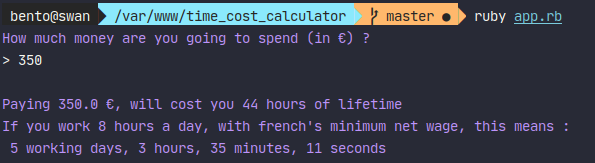

## Price to Timelife Converter

### Installation

To install the project, follow these steps :
1. Use command `git clone` to clone the project on your environnment
2. Use command `CD` to go in the project's repository
3. Launch the program thanks to the command `ruby app.rb`

### Presentation

This is a CLI program converting a price (in €) into the exact number of hours
 needed to gain this money. Calculations are based on the French "net" SMIC
 , meaning the minimum salary you can be paid in France once you paid all the
  taxes.

Example :

## Possible improvements
- Checks input type (float) and ask to retry if it isn't the right type.
- Add unit tests
